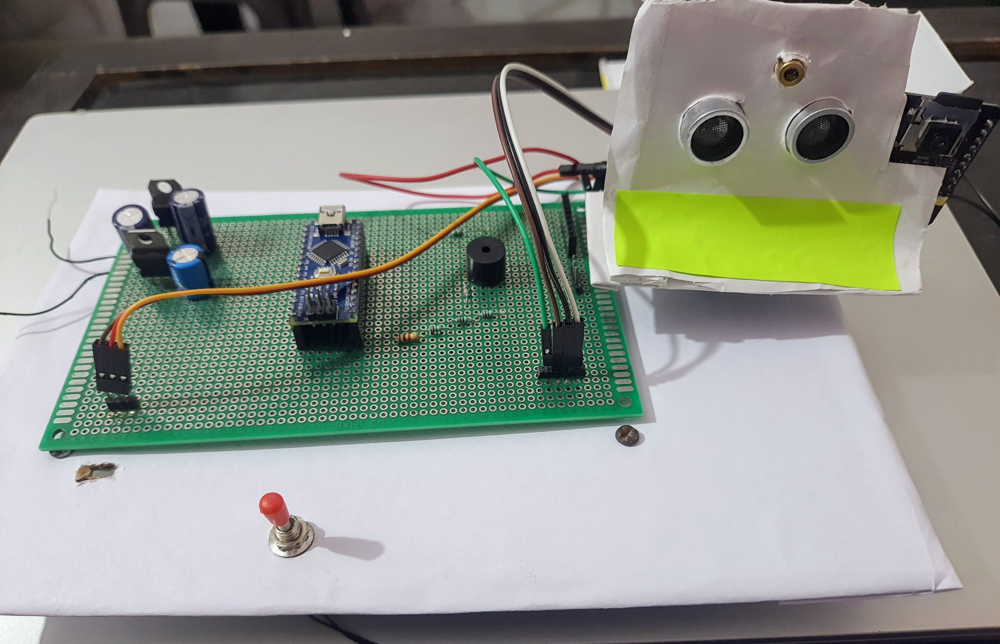

# Automated Surveillance System with Real-Time Email Alerts

> *A dual-microcontroller security system featuring autonomous scanning, intrusion detection, and SMTP-based remote alerting.*

## 📖 Overview
This project is an embedded surveillance solution designed to monitor spaces autonomously. Unlike standard passive sensors, this system actively scans a 180° field of view. When an intrusion is detected, it triggers a multi-stage alert system: local audio/visual deterrents are activated immediately, while a captured image is processed and transmitted to the user's email via Wi-Fi in real-time.

The system mimics a distributed architecture by offloading tasks: high-frequency sensor management is handled by an **Arduino Nano**, while image processing and network communication are managed by an **ESP32-CAM**, linked via a custom UART protocol.

## 🚀 Key Features
* **Active Scanning:** Servo-mounted ultrasonic sensor sweeps 0°-180° to cover a wide area.
* **Dual-Core Processing:** Decoupled sensor logic (Nano) from network logic (ESP32) for improved stability.
* **Real-Time Alerts:** Sends high-resolution JPEG snapshots via Gmail SMTP (TLS 1.2).
* **Intelligent Triggering:** Includes logic to prevent motion blur by stopping the servo before image capture.
* **Robust Error Handling:** Features auto-recovery after power loss and debouncing for rapid trigger events.

## 🛠️ Tech Stack & Hardware
* **Microcontrollers:** Arduino Nano (ATmega328P), ESP32-CAM (AI-Thinker).
* **Sensors & Actuators:** HC-SR04 Ultrasonic Sensor, SG90 Servo, Laser Diode, Piezo Buzzer.
* **Communication:** UART (Serial) between boards, SMTP over Wi-Fi for cloud alerts.
* **Languages:** C++ (Arduino Framework).
* **Libraries:** `ESP-Mail-Client`, `esp_camera.h`, `Servo.h`.

## ⚙️ System Architecture
The system follows a **Master-Slave architecture**:

1.  **Detection (Arduino Nano):** * Continuously sweeps the servo.
    * Reads ultrasonic distance (Threshold: <20cm).
    * On trigger: Stops servo (to stabilize camera), activates local alarms (Laser/Buzzer), and transmits a serialized `CAPTURE` command via UART.
2.  **Processing (ESP32-CAM):**
    * Ideally sleeps or idles until UART interrupt.
    * Parses the incoming serial string.
    * Captures an SVGA (800x600) image.
    * Encodes image to Base64 and transmits via SMTP.

## 📊 Performance & Results
* **Latency:** Average time from detection to email receipt is **4.2 seconds**.
* **Reliability:** 90% reliable detection for objects >20cm at 1.5m range.
* **Autonomy:** Operates for ~6 hours on a 2200mAh battery.

## 🧠 Technical Challenges Solved

* **UART Signal Integrity & Latency:**
    * *Challenge:* The ESP32-CAM frequently missed "CAPTURE" commands from the Nano during testing.
    * *Solution:* Diagnosed a **UART port contention** issue where excessive debug logging was blocking the receiving buffer. I implemented a `DEBUG` flag in the code to disable all non-essential serial output during production, ensuring the "CAPTURE" interrupt is prioritized and processed instantly.

* **Voltage Level Shifting:**
    * *Challenge:* Interfacing the 5V logic of the Arduino Nano with the sensitive 3.3V logic of the ESP32-CAM created a risk of hardware damage.
    * *Solution:* Designed a voltage divider circuit (using 1.66kΩ and 3.3kΩ resistors) to step down the Nano's TX signal to a safe 3.3V, ensuring reliable communication without frying the ESP32's RX pin.

* **Hardware Power Stability (Brownouts):**
    * *Challenge:* During the firmware flashing phase, the ESP32 would consistently fail and reset at 8% progress.
    * *Solution:* Diagnosed a **power brownout issue** caused by the insufficient current drive of a generic FTDI-style adapter. Resolved by switching to a robust **CP2102-based USB-to-TTL converter**, capable of sustaining the high-current spikes required during flash memory write cycles.
      
* **Motion Blur Prevention:**
    * *Challenge:* The camera triggered while the servo was still moving, resulting in blurry, unusable images.
    * *Solution:* Implemented a software logic halt that strictly stops the servo motor's sweep *before* the shutter command is sent, ensuring the camera is static for the duration of the exposure.
## 🔮 Future Improvements
* **Computer Vision:** Integrate TinyML on the ESP32 to distinguish between humans and pets/objects.
* **Remote Control:** Add an MQTT handler to allow users to toggle the system ON/OFF remotely via a mobile dashboard.
* **Night Vision:** Add IR illumination for low-light performance.

## 📄 Documentation
For a deep dive into the wiring, code logic, and testing data, please refer to the [Project Documentation (PDF)](docs/Project_documentation.pdf).

## 📜 License
MIT License - see [LICENSE](LICENSE) for details.
